# Eye-Rest Application - Complete Feature Specification

## Overview

Eye-Rest is a comprehensive Windows desktop application designed to promote healthy computing habits through automated eye rest and break reminders. This document describes all features, use cases, and system workflows based on the current codebase implementation.

**Core Mission**: Help users maintain eye health and productivity through configurable rest periods and intelligent system integration.

---

## Table of Contents

1. [Core Features](#core-features)
2. [Timer System](#timer-system)
3. [User Presence Detection](#user-presence-detection)
4. [System Integration](#system-integration)
5. [Use Cases & Workflows](#use-cases--workflows)
6. [Configuration Options](#configuration-options)
7. [Analytics & Reporting](#analytics--reporting)
8. [Advanced Features](#advanced-features)

---

## Core Features

### 1. Dual Timer System

**Eye Rest Timer**
- **Interval**: 20 minutes (default, configurable)
- **Duration**: 20 seconds (default, configurable)  
- **Purpose**: Short eye rest breaks following the 20-20-20 rule
- **Behavior**: Warning popup → Rest reminder → Automatic completion

**Break Timer**
- **Interval**: 55 minutes (default, configurable)
- **Duration**: 5 minutes (default, configurable)
- **Purpose**: Extended work break for physical movement
- **Behavior**: Warning popup → Break popup with delay/skip options → Confirmation required

### 2. Smart Popup System

**Warning Popups**
- Eye Rest: 15 seconds before due (configurable: 15-30s)
- Break: 30 seconds before due (configurable: 15-60s)
- Purpose: Prepare user for upcoming rest period
- Actions: Shows countdown, can be closed with ESC

**Rest/Break Popups**
- Full-screen overlay with opacity control (50-100%)
- Multi-monitor support (appears on all screens)
- User options: Complete, Delay (1min/5min), Skip
- Audio notifications with customizable sounds

### 3. Break Completion Flow with Flexible Timing

**Done Screen States**
- **Grace Period (0-10 seconds)**: Done screen visible, no timer display
  - Background: Light blue (#ADD8E6) for clear completion state
  - Title: "Break Complete – Continue when ready"
  - Message: "Break complete! Great job!"
  - Purpose: Allow user to finish task before interacting

- **Forward Timer Active (10+ seconds)**: Timer shows elapsed extension time
  - Timer starts at 0:10 (10 seconds elapsed from Done screen appearance)
  - Counts upward continuously showing time extended
  - Format: "M minutes SS seconds extended"
  - Updates every 100ms for smooth display
  - Waits indefinitely until user clicks "Done" button (no timeout)

**Completion Behavior**
- Users can click "Done" immediately or wait any duration
- Forward timer provides transparency about break extension time
- Session resets immediately upon "Done" click (fresh 55-minute break cycle)
- Light blue background distinguishes completion from warning states
- Works consistently across multi-monitor configurations

### 4. User Presence Detection

**Detection Methods**
- Keyboard/mouse idle time monitoring (5-minute threshold)
- Windows session lock/unlock detection
- Monitor power state monitoring (on/off)
- System sleep/hibernate detection

**Smart Behaviors**
- Auto-pause timers when user away
- Auto-resume when user returns
- Extended away period detection (30+ minutes)
- Fresh session start after overnight absence

### 5. System Integration

**System Tray Integration**
- Always-running background service
- Context menu with timer controls (pause/resume/status)
- Visual status indicators (active/paused/error/user away)
- Timer progress tooltip updates

**Windows Integration**
- Starts with Windows (optional)
- Minimizes to system tray
- Handles system sleep/wake cycles
- DPI awareness for multi-monitor setups

---

## Timer System

### Timer State Machine

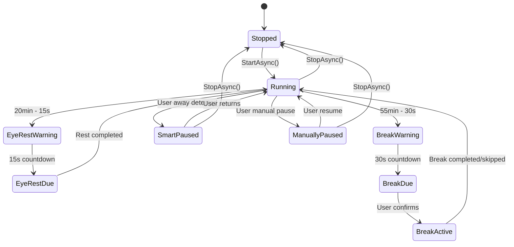

### Timer Event Flow

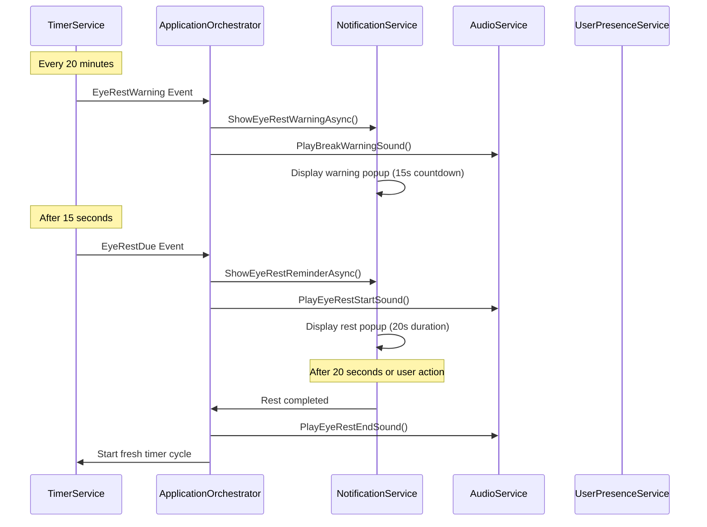

---

## User Presence Detection

### Presence State Management

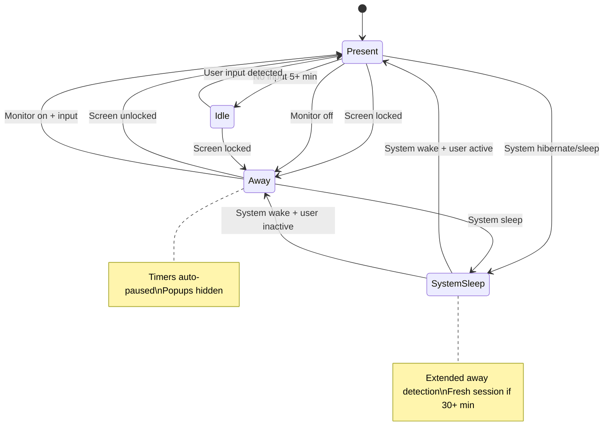

### Extended Away Detection

**Purpose**: Detect overnight or extended absence periods to start fresh working sessions.

**Criteria**:
- Away time ≥ 30 minutes (configurable: 15-120 minutes)
- Includes: overnight standby, long meetings, extended breaks
- Detected on system resume or user return from idle

**Behavior** (Unconditional Reset):
1. Detect extended away period on system resume or return from idle
2. **Unconditionally reset** session regardless of prior state
3. Clear all timer states completely
4. Close all active popups and popup references using multiple methods:
   - Direct notification service calls
   - Reflection-based state clearing for popup references
   - Event flag clearing to prevent pending notifications
5. Start fresh timer cycles (20min eye rest, 55min break)
6. Show optional "Fresh session started" notification
7. Reset analytics tracking to new session
8. Ensure no stale events fire after reset

**Critical Details**:
- **No State Preservation**: Unlike short breaks (<30 min), extended away triggers complete reset
- **Popup Clearing**: All popup windows closed AND popup state references cleared
- **Event Flag Cleanup**: All processing flags (_isProcessingEyeRestEvent, etc.) explicitly cleared
- **Recovery Coordination**: Health monitor and pause management work together to ensure clean state
- **Race Condition Prevention**: Unconditional reset eliminates timing-dependent behavior

**Accepted Behavior**:
- If user was in middle of break or eye rest popup when extended away triggered, it will be cleared
- This is intentional - users expect fresh start after 30+ minutes away
- Provides consistent, predictable experience

---

## Use Cases & Workflows

### Use Case 1: Normal Working Session

**Scenario**: User working continuously at computer

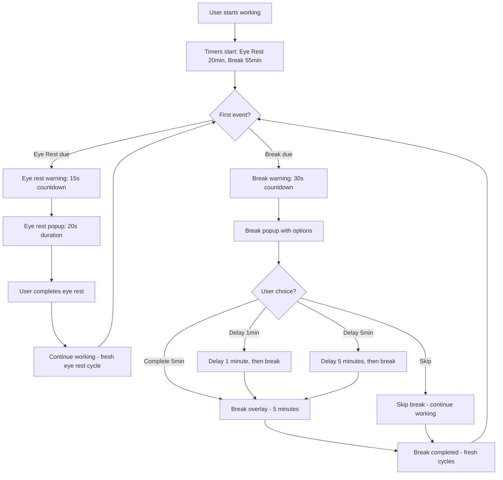

### Use Case 2: User Leaves PC for Extended Period

**Scenario**: User leaves for lunch, meeting, or end of day

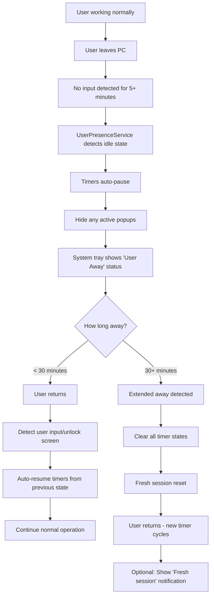

### Use Case 3: Break Completion with Flexible Timing

**Scenario**: Break countdown completes and user completes their break when ready

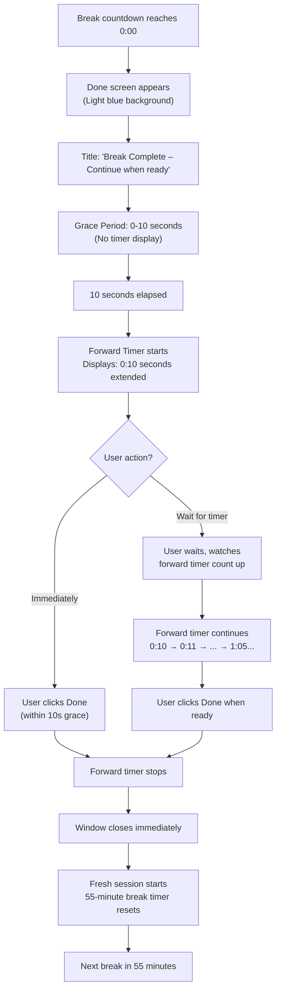

### Use Case 5: System Sleep/Standby

**Scenario**: User puts PC to sleep or system hibernates

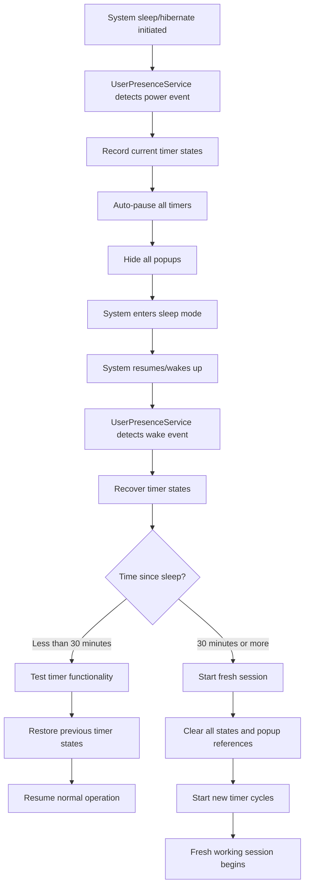

### Use Case 6: System Crash/Recovery

**Scenario**: Application or system crashes and recovers

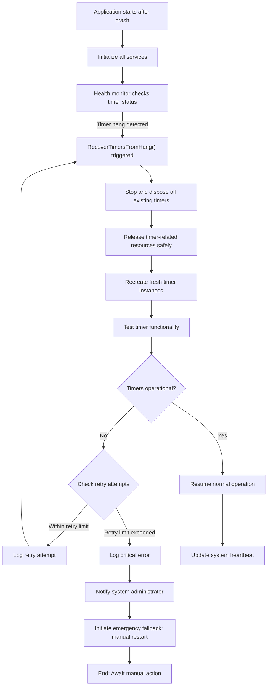

### Use Case 7: Manual Timer Control

**Scenario**: User manually controls timers via system tray

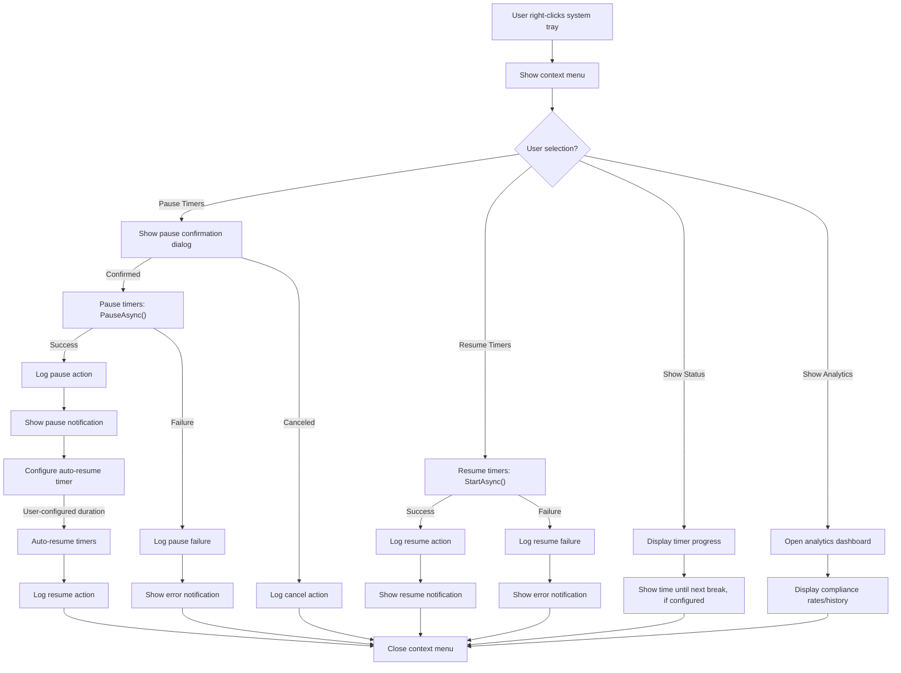

---

## Configuration Options

### Timer Configuration

```yaml
EyeRest:
  IntervalMinutes: 20        # Time between eye rest reminders
  DurationSeconds: 20        # Duration of eye rest
  WarningSeconds: 15         # Warning time before eye rest
  StartSoundEnabled: true    # Play sound at start
  EndSoundEnabled: true      # Play sound at end

Break:
  IntervalMinutes: 55        # Time between break reminders  
  DurationMinutes: 5         # Duration of break
  WarningSeconds: 30         # Warning time before break
  OverlayOpacityPercent: 80  # Popup overlay opacity
  RequireConfirmationAfterBreak: true
  ResetTimersOnBreakConfirmation: true
```

### User Presence Configuration

```yaml
UserPresence:
  Enabled: true
  IdleThresholdMinutes: 5           # Idle detection time
  AwayGracePeriodSeconds: 30        # Grace period before pause
  AutoPauseOnAway: true             # Auto-pause when away
  AutoResumeOnReturn: true          # Auto-resume when back
  ExtendedAwayThresholdMinutes: 30  # Fresh session threshold
  EnableSmartSessionReset: true     # Fresh session after extended away
```

### Audio Configuration

```yaml
Audio:
  Enabled: true
  Volume: 50                    # Volume level (0-100)
  CustomSoundPath: null         # Path to custom sound file
```

---

## Analytics & Reporting

### Data Collection

**Session Tracking**
- Work session duration and activity patterns
- Break compliance rates and skip frequencies
- User presence state changes and idle time
- Timer pause/resume events with reasons

**Event Recording**
- Eye rest completion/skip/delay events
- Break completion/skip/delay events with duration
- User presence changes with timestamps
- System sleep/wake cycles

**Health Metrics**
- Compliance rate: `(breaks_taken / breaks_due) * 100`
- Average break duration vs. configured duration
- Daily/weekly/monthly activity summaries
- Trend analysis for habit formation

### Analytics Dashboard Workflow

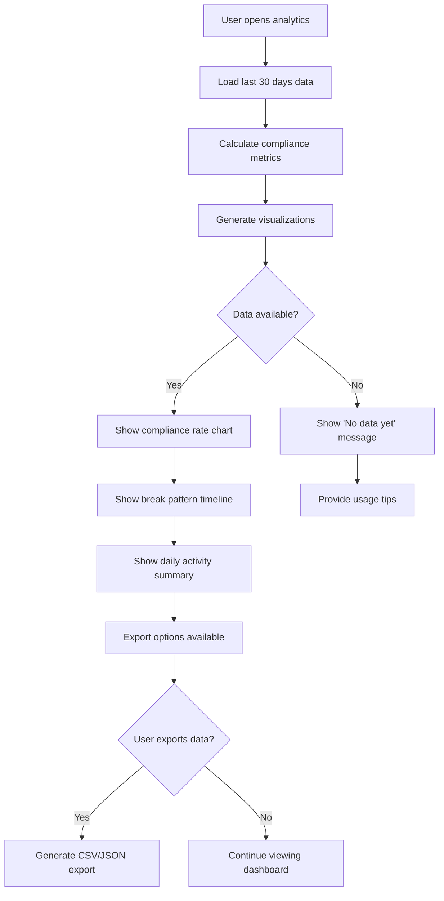

---

## Advanced Features

### Break Popup System Enhancements

**Done Screen Behavior**
The break completion flow has been enhanced to provide users with flexible timing and complete transparency about break extensions.

**Visual Design**
- Background: Light blue (#ADD8E6) instead of green - provides clear distinction from warning popups
- Title: "Break Complete – Continue when ready" - indicates flexibility in timing
- Message: "Break complete! Great job!" - positive reinforcement
- Confirmation Button: "Done - Start Fresh Session" or "Done - Resume Timers" (configurable)

**Grace Period (0-10 seconds)**
- Allows user to finish current task before interacting with popup
- No timer display shown during this period
- Popup remains visible but non-intrusive

**Forward Timer Display (10+ seconds)**
- Automatically starts after 10-second grace period
- Initial display: 0:10 (representing 10 seconds elapsed)
- Counts upward continuously: 0:10 → 0:11 → ... → 1:00 → 1:01...
- Format: "M minutes SS seconds extended"
- Update frequency: Every 100ms for smooth, real-time display
- Label: "time extended" to clarify meaning

**Indefinite Waiting (No Timeout)**
- Done screen waits indefinitely for user action
- No auto-close timeout - user has complete control
- Forward timer continues counting as long as popup is visible
- User can click Done at any time

**Session Reset Behavior**
- Upon "Done" click: Forward timer stops immediately
- Window closes cleanly without delay
- Fresh session starts immediately with full timer intervals
- Next break timer resets to 55 minutes (default)
- Next eye rest timer resets to 20 minutes (default)

**Implementation Details - Race Condition Prevention**
Critical fixes implemented to ensure Done screen behavior is reliable:

1. **Synchronous Flag Setting**: `_isWaitingForBreakConfirmation` flag is set BEFORE Done screen displays
   - Prevents recovery routines from closing popup during async delays
   - Ensures popup state is immediately recognizable to system

2. **Recovery Routine Safety Check**: Explicit check in health monitor for confirmation state
   - Even if state somehow gets out of sync, popup is explicitly preserved
   - Provides defense-in-depth protection
   - Enhanced logging identifies any state issues

3. **Timeout Removal**: Eliminated 10-minute timeout that was auto-closing Done screen
   - Now waits only for explicit user action
   - No background tasks trying to close popup

**Testing Verified**
- ✅ Done screen shows for minimum 10 seconds (grace period)
- ✅ Forward timer starts at 0:10 after grace period
- ✅ Forward timer counts upward in real-time
- ✅ Done screen stays visible indefinitely until user clicks Done
- ✅ Light blue background consistent on all monitors
- ✅ Fresh session starts immediately on Done click
- ✅ No auto-close timeouts

### Meeting Detection (Future Enhancement)

**Status**: Currently disabled in codebase - requires improvement and testing

**Planned Capabilities**:
- Detect Microsoft Teams, Zoom, WebEx meetings
- Auto-pause timers during detected meetings
- Visual meeting mode indicator in system tray
- Manual override options

**Detection Methods**:
```yaml
MeetingDetection:
  Enabled: false                    # Currently disabled
  DetectionMethod: WindowBased      # Window title analysis
  EnableTeamsDetection: true
  EnableZoomDetection: true
  EnableWebexDetection: true
  AutoPauseTimers: true
  ShowMeetingModeIndicator: true
```

### System Tray Features

**Visual Indicators**
- Active: Blue eye icon - timers running normally
- Paused: Gray icon - timers manually paused
- User Away: Orange icon - auto-paused due to user absence
- Error: Red icon - system error or recovery needed

**Context Menu Options**
- Pause/Resume Timers
- Show Timer Status
- Show Analytics Dashboard  
- Settings & Configuration
- Exit Application (with confirmation)

**Progressive Tooltip Updates**
- Real-time countdown: "Next eye rest in 15:32"
- State information: "Paused (user away)" 
- Health summary: "Today: 8/10 breaks completed"

---

## System Architecture Integration

### Service Dependencies

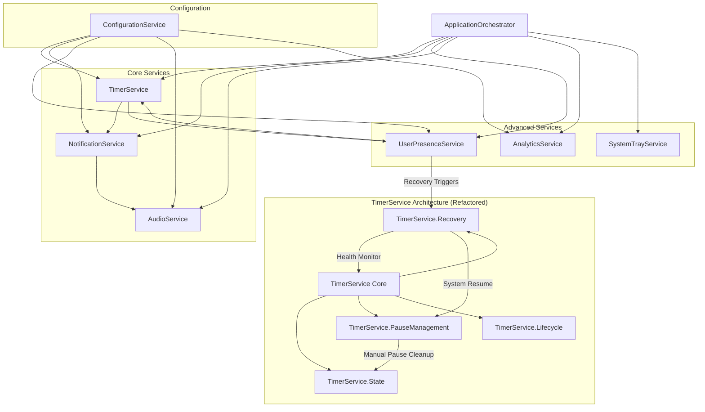

### Event Flow Architecture

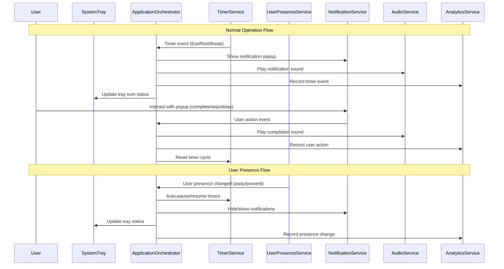

---

## Error Handling & Recovery

### Recovery Scenarios

**Timer Hang Recovery**
- Health monitor detects no heartbeat for 3+ minutes
- Automatic timer recreation with fresh DispatcherTimer instances
- Popup state clearing to prevent zombie references
- Validation and logging of recovery success

**System Resume Recovery**
- Detect extended away periods (30+ minutes)
- **Unconditional fresh session reset** with clean timer states
- Enhanced popup reference clearing using reflection
- **CRITICAL FIX**: Manual pause state coordination repair
- Comprehensive validation of timer functionality
- Automatic UI state synchronization after recovery

**Break Done Screen Auto-Close Prevention**
- **Issue**: Done screen popup was auto-closing before user could confirm
- **Root Cause**: Race condition between synchronous UI display and asynchronous flag setting
- **Timeline**: 100ms delay in setting `_isWaitingForBreakConfirmation` flag allowed recovery routines to close popup
- **P0 FIX**: Move flag setting to synchronous code path BEFORE Done screen appears
  - Flag now set immediately when break countdown completes
  - Recovery routines see correct popup state
  - Popup marked as "waiting for confirmation" before visible
- **P1 FIX**: Add explicit safety check in recovery routine for confirmation state
  - Uses reflection to check `_isWaitingForBreakConfirmation` field
  - Explicitly blocks popup closing when confirmation is pending
  - Provides defense-in-depth if state somehow gets out of sync
- **Timeout Removal**: Eliminated 10-minute auto-close timeout
  - Now waits indefinitely for user "Done" click
  - Forward timer continues counting to show elapsed extension time
  - User has complete control over break duration

**Manual Pause State Coordination**
- **Issue**: Manual pause states could persist after extended absence
- **Detection**: Health monitor identifies coordination failures
- **Resolution**: Comprehensive cleanup of manual pause timers and state
- **Recovery Triggers**: Session unlock, console connect, monitor power on
- **UI Synchronization**: Property change notifications ensure correct display
- **Guarantee**: Timers ALWAYS resume counting when user returns

**Configuration Recovery**
- Automatic default restoration for corrupt config files
- Validation of all configuration parameters
- Graceful degradation with logging for invalid settings

---

## Performance Specifications

### Resource Requirements

**Memory Usage**
- Target: < 50MB when idle
- Components: UI (15MB), Timers (10MB), Analytics (15MB), Overhead (10MB)
- Monitoring: Continuous validation with automatic cleanup

**CPU Usage**
- Background monitoring: < 1% CPU average
- Timer events: Brief spikes (< 5% for < 1 second)
- Popup display: Moderate usage during active popups

**Startup Performance**
- Target: < 3 seconds from launch to fully operational
- Lazy initialization of non-critical services
- Optimized service dependency chain

### Reliability Metrics

**Uptime Requirements**
- 99.9% availability during user sessions
- Automatic recovery from transient failures  
- Graceful degradation when components fail

**Accuracy Requirements**
- Timer events: ±1 second accuracy
- User presence detection: < 5 second response time
- System resume detection: < 10 second recovery time

---

## Conclusion

The Eye-Rest application provides a comprehensive, intelligent solution for maintaining healthy computing habits. Through its dual timer system, smart user presence detection, and robust system integration, it seamlessly adapts to various user workflows and system states.

**Key Strengths**:
- **Intelligent Automation**: Smart pause/resume based on user presence
- **System Integration**: Robust handling of sleep/wake cycles and extended away periods
- **User-Centric Design**: Flexible configuration and non-intrusive operation
- **Reliability**: Comprehensive error handling and automatic recovery
- **Analytics**: Detailed tracking and insights for habit formation

The application is designed to "just work" in the background, providing valuable health reminders while intelligently adapting to the user's actual usage patterns and system state changes.