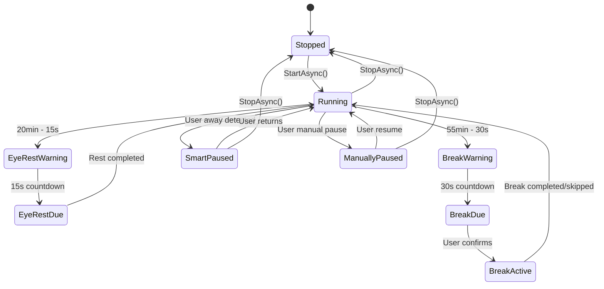
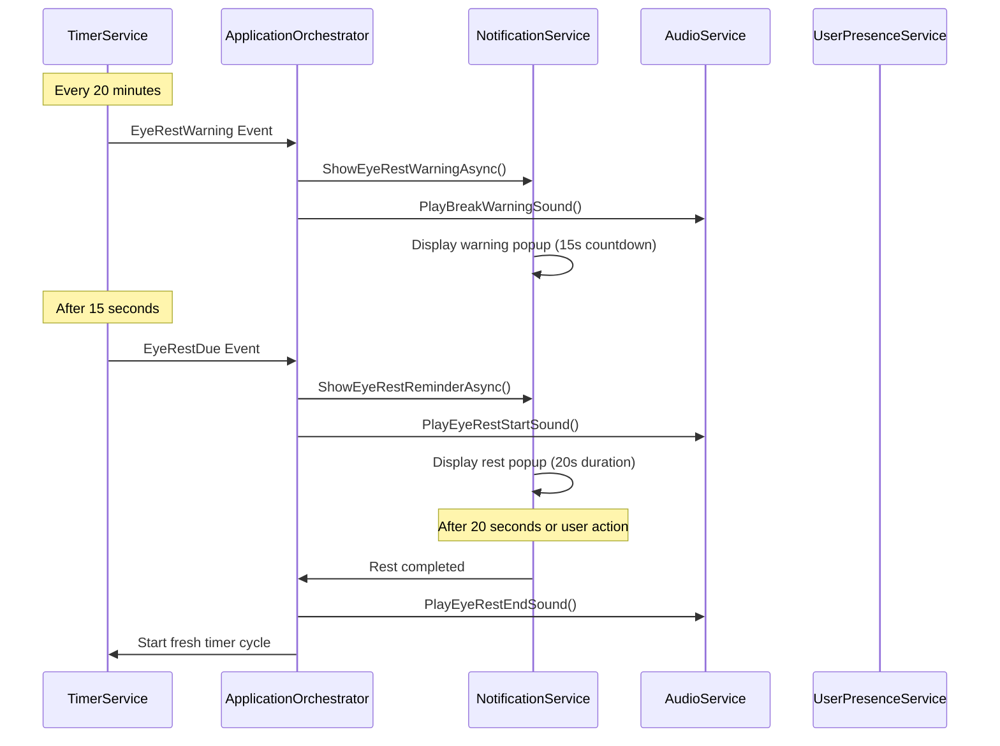
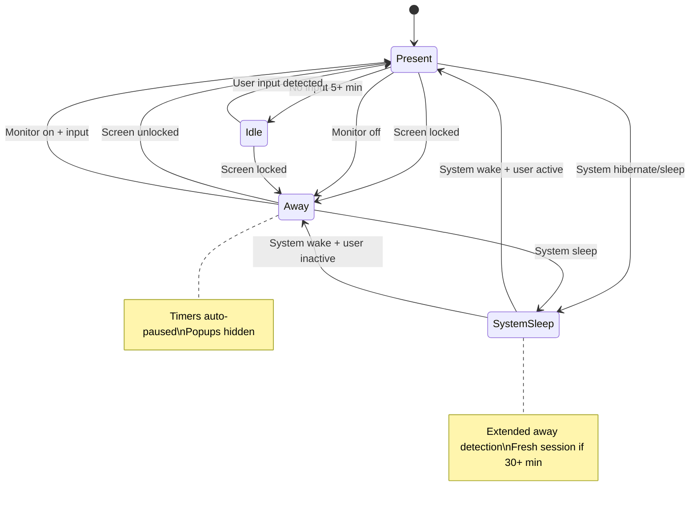
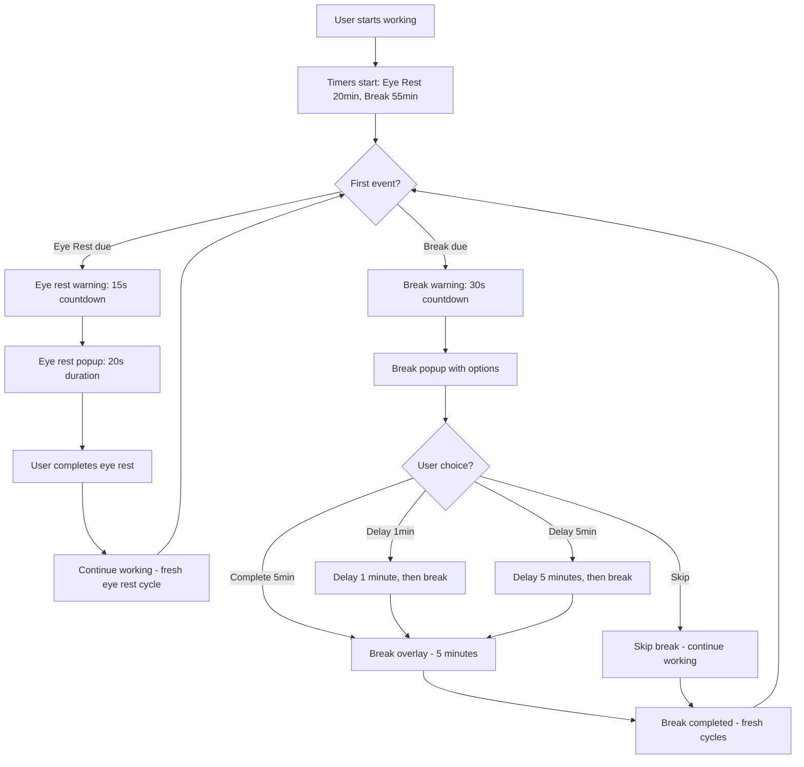
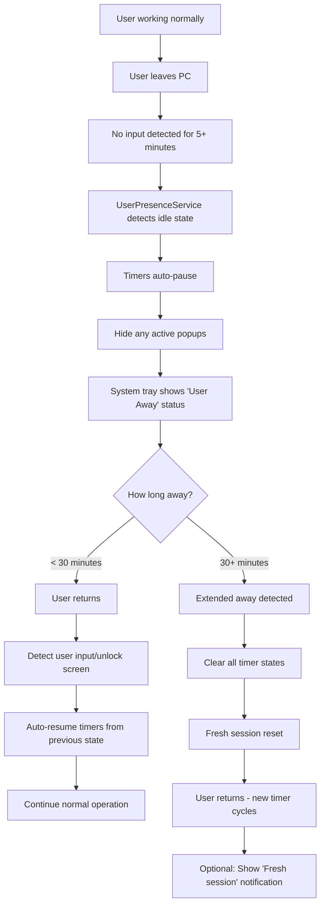
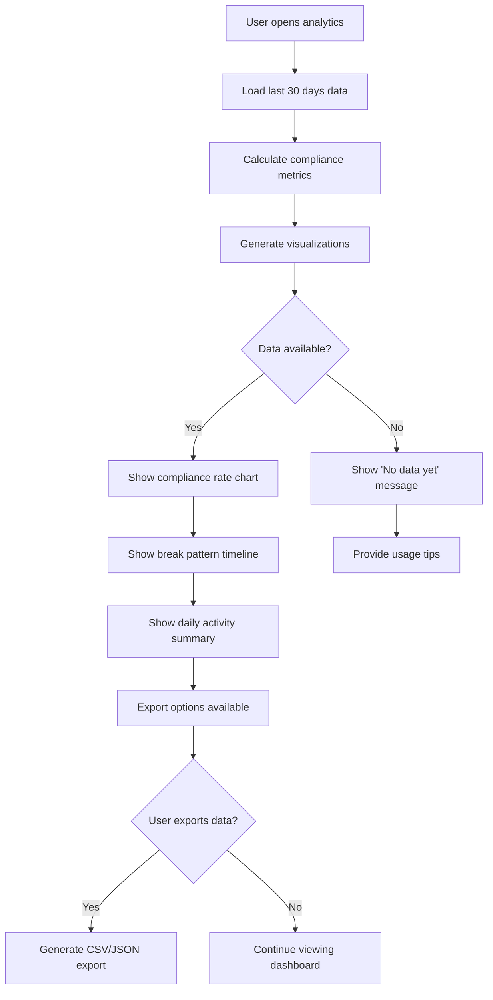
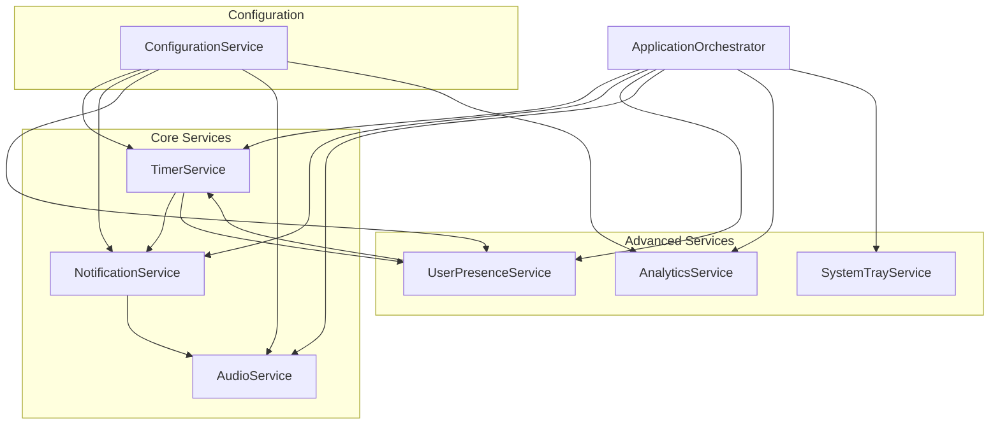
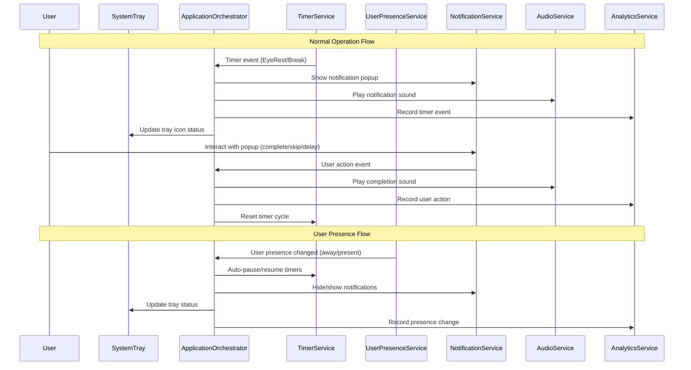

# Eye-Rest Application - Complete Feature Specification

## Overview

Eye-Rest is a comprehensive Windows desktop application designed to promote healthy computing habits through automated eye rest and break reminders. This document describes all features, use cases, and system workflows based on the current codebase implementation.

**Core Mission**: Help users maintain eye health and productivity through configurable rest periods and intelligent system integration.

---

## Table of Contents

1. [Core Features](#core-features)
2. [Timer System](#timer-system)
3. [User Presence Detection](#user-presence-detection)
4. [System Integration](#system-integration)
5. [Use Cases & Workflows](#use-cases--workflows)
6. [Configuration Options](#configuration-options)
7. [Analytics & Reporting](#analytics--reporting)
8. [Advanced Features](#advanced-features)

---

## Core Features

### 1. Dual Timer System

**Eye Rest Timer**
- **Interval**: 20 minutes (default, configurable)
- **Duration**: 20 seconds (default, configurable)  
- **Purpose**: Short eye rest breaks following the 20-20-20 rule
- **Behavior**: Warning popup → Rest reminder → Automatic completion

**Break Timer**
- **Interval**: 55 minutes (default, configurable)
- **Duration**: 5 minutes (default, configurable)
- **Purpose**: Extended work break for physical movement
- **Behavior**: Warning popup → Break popup with delay/skip options → Confirmation required

### 2. Smart Popup System

**Warning Popups**
- Eye Rest: 15 seconds before due (configurable: 15-30s)
- Break: 30 seconds before due (configurable: 15-60s)
- Purpose: Prepare user for upcoming rest period
- Actions: Shows countdown, can be closed with ESC

**Rest/Break Popups**
- Full-screen overlay with opacity control (50-100%)
- Multi-monitor support (appears on all screens)
- User options: Complete, Delay (1min/5min), Skip
- Audio notifications with customizable sounds

### 3. User Presence Detection

**Detection Methods**
- Keyboard/mouse idle time monitoring (5-minute threshold)
- Windows session lock/unlock detection
- Monitor power state monitoring (on/off)
- System sleep/hibernate detection

**Smart Behaviors**
- Auto-pause timers when user away
- Auto-resume when user returns
- Extended away period detection (30+ minutes)
- Fresh session start after overnight absence

### 4. System Integration

**System Tray Integration**
- Always-running background service
- Context menu with timer controls (pause/resume/status)
- Visual status indicators (active/paused/error/user away)
- Timer progress tooltip updates

**Windows Integration**
- Starts with Windows (optional)
- Minimizes to system tray
- Handles system sleep/wake cycles
- DPI awareness for multi-monitor setups

---

## Timer System

### Timer State Machine



### Timer Event Flow



---

## User Presence Detection

### Presence State Management



### Extended Away Detection

**Purpose**: Detect overnight or extended absence periods to start fresh working sessions.

**Criteria**:
- Away time ≥ 30 minutes (configurable: 15-120 minutes)
- Includes: overnight standby, long meetings, extended breaks
- Smart session reset enabled in configuration

**Behavior**:
1. Detect extended away period on system resume
2. Clear all timer states and popup references  
3. Start fresh timer cycles (20min eye rest, 55min break)
4. Show optional "Fresh session started" notification
5. Reset analytics tracking to new session

---

## Use Cases & Workflows

### Use Case 1: Normal Working Session

**Scenario**: User working continuously at computer



### Use Case 2: User Leaves PC for Extended Period

**Scenario**: User leaves for lunch, meeting, or end of day



### Use Case 3: System Sleep/Standby

**Scenario**: User puts PC to sleep or system hibernates

```mermaid
flowchart TD
    A[System sleep/hibernate initiated] --> B[UserPresenceService detects power event]
    B --> C[Record current timer states]
    C --> D[Auto-pause all timers]
    D --> E[Hide all popups]
    E --> F[System enters sleep mode]
    
    F --> G[System resumes/wakes up]
    G --> H[UserPresenceService detects wake event]
    H --> I[TimerService.RecoverFromSystemResumeAsync()]
    I --> J{Time since sleep?}
    
    J -->|< 30 minutes| K[Test timer functionality]
    K --> L[Restore previous timer states]
    L --> M[Resume normal operation]
    
    J -->|30+ minutes| N[Extended away - Fresh session]
    N --> O[Clear all states and popup references]
    O --> P[Start new timer cycles]
    P --> Q[Fresh working session begins]
```

### Use Case 4: System Crash/Recovery

**Scenario**: Application or system crashes and recovers

```mermaid
flowchart TD
    A[Application starts after crash] --> B[Initialize all services]
    B --> C[Health monitor detects timer hang]
    C --> D[RecoverTimersFromHang() triggered]
    D --> E[Stop and dispose all existing timers]
    E --> F[Force garbage collection]
    F --> G[Clear all popup references via reflection]
    G --> H[Recreate fresh timer instances]
    H --> I[Test timer functionality]
    I --> J{Timers working?}
    
    J -->|Yes| K[Resume normal operation]
    J -->|No| L[Emergency fallback: manual restart]
    
    K --> M[Update heartbeat - recovery successful]
    L --> N[Log critical error - user intervention needed]
```

### Use Case 5: Manual Timer Control

**Scenario**: User manually controls timers via system tray

```mermaid
flowchart TD
    A[User right-clicks system tray] --> B[Context menu appears]
    B --> C{User selection?}
    
    C -->|Pause Timers| D[Manual pause with confirmation]
    D --> E[PauseAsync() with reason 'Manual']
    E --> F[Show pause reminders every hour]
    F --> G[Auto-resume after 8 hours max]
    
    C -->|Resume Timers| H[Manual resume]
    H --> I[StartAsync() - continue from where left]
    
    C -->|Show Status| J[Display current timer progress]
    J --> K[Show time until next eye rest/break]
    
    C -->|Show Analytics| L[Open analytics dashboard]
    L --> M[Display compliance rates and history]
```

---

## Configuration Options

### Timer Configuration

```yaml
EyeRest:
  IntervalMinutes: 20        # Time between eye rest reminders
  DurationSeconds: 20        # Duration of eye rest
  WarningSeconds: 15         # Warning time before eye rest
  StartSoundEnabled: true    # Play sound at start
  EndSoundEnabled: true      # Play sound at end

Break:
  IntervalMinutes: 55        # Time between break reminders  
  DurationMinutes: 5         # Duration of break
  WarningSeconds: 30         # Warning time before break
  OverlayOpacityPercent: 80  # Popup overlay opacity
  RequireConfirmationAfterBreak: true
  ResetTimersOnBreakConfirmation: true
```

### User Presence Configuration

```yaml
UserPresence:
  Enabled: true
  IdleThresholdMinutes: 5           # Idle detection time
  AwayGracePeriodSeconds: 30        # Grace period before pause
  AutoPauseOnAway: true             # Auto-pause when away
  AutoResumeOnReturn: true          # Auto-resume when back
  ExtendedAwayThresholdMinutes: 30  # Fresh session threshold
  EnableSmartSessionReset: true     # Fresh session after extended away
```

### Audio Configuration

```yaml
Audio:
  Enabled: true
  Volume: 50                    # Volume level (0-100)
  CustomSoundPath: null         # Path to custom sound file
```

---

## Analytics & Reporting

### Data Collection

**Session Tracking**
- Work session duration and activity patterns
- Break compliance rates and skip frequencies
- User presence state changes and idle time
- Timer pause/resume events with reasons

**Event Recording**
- Eye rest completion/skip/delay events
- Break completion/skip/delay events with duration
- User presence changes with timestamps
- System sleep/wake cycles

**Health Metrics**
- Compliance rate: `(breaks_taken / breaks_due) * 100`
- Average break duration vs. configured duration
- Daily/weekly/monthly activity summaries
- Trend analysis for habit formation

### Analytics Dashboard Workflow



---

## Advanced Features

### Meeting Detection (Future Enhancement)

**Status**: Currently disabled in codebase - requires improvement and testing

**Planned Capabilities**:
- Detect Microsoft Teams, Zoom, WebEx meetings
- Auto-pause timers during detected meetings
- Visual meeting mode indicator in system tray
- Manual override options

**Detection Methods**:
```yaml
MeetingDetection:
  Enabled: false                    # Currently disabled
  DetectionMethod: WindowBased      # Window title analysis
  EnableTeamsDetection: true
  EnableZoomDetection: true
  EnableWebexDetection: true
  AutoPauseTimers: true
  ShowMeetingModeIndicator: true
```

### System Tray Features

**Visual Indicators**
- Active: Blue eye icon - timers running normally
- Paused: Gray icon - timers manually paused
- User Away: Orange icon - auto-paused due to user absence
- Error: Red icon - system error or recovery needed

**Context Menu Options**
- Pause/Resume Timers
- Show Timer Status
- Show Analytics Dashboard  
- Settings & Configuration
- Exit Application (with confirmation)

**Progressive Tooltip Updates**
- Real-time countdown: "Next eye rest in 15:32"
- State information: "Paused (user away)" 
- Health summary: "Today: 8/10 breaks completed"

---

## System Architecture Integration

### Service Dependencies



### Event Flow Architecture



---

## Error Handling & Recovery

### Recovery Scenarios

**Timer Hang Recovery**
- Health monitor detects no heartbeat for 3+ minutes
- Automatic timer recreation with fresh DispatcherTimer instances
- Popup state clearing to prevent zombie references
- Validation and logging of recovery success

**System Resume Recovery**  
- Detect extended away periods (30+ minutes)
- Fresh session reset with clean timer states
- Enhanced popup reference clearing using reflection
- Comprehensive validation of timer functionality

**Configuration Recovery**
- Automatic default restoration for corrupt config files
- Validation of all configuration parameters
- Graceful degradation with logging for invalid settings

---

## Performance Specifications

### Resource Requirements

**Memory Usage**
- Target: < 50MB when idle
- Components: UI (15MB), Timers (10MB), Analytics (15MB), Overhead (10MB)
- Monitoring: Continuous validation with automatic cleanup

**CPU Usage**
- Background monitoring: < 1% CPU average
- Timer events: Brief spikes (< 5% for < 1 second)
- Popup display: Moderate usage during active popups

**Startup Performance**
- Target: < 3 seconds from launch to fully operational
- Lazy initialization of non-critical services
- Optimized service dependency chain

### Reliability Metrics

**Uptime Requirements**
- 99.9% availability during user sessions
- Automatic recovery from transient failures  
- Graceful degradation when components fail

**Accuracy Requirements**
- Timer events: ±1 second accuracy
- User presence detection: < 5 second response time
- System resume detection: < 10 second recovery time

---

## Conclusion

The Eye-Rest application provides a comprehensive, intelligent solution for maintaining healthy computing habits. Through its dual timer system, smart user presence detection, and robust system integration, it seamlessly adapts to various user workflows and system states.

**Key Strengths**:
- **Intelligent Automation**: Smart pause/resume based on user presence
- **System Integration**: Robust handling of sleep/wake cycles and extended away periods
- **User-Centric Design**: Flexible configuration and non-intrusive operation
- **Reliability**: Comprehensive error handling and automatic recovery
- **Analytics**: Detailed tracking and insights for habit formation

The application is designed to "just work" in the background, providing valuable health reminders while intelligently adapting to the user's actual usage patterns and system state changes.